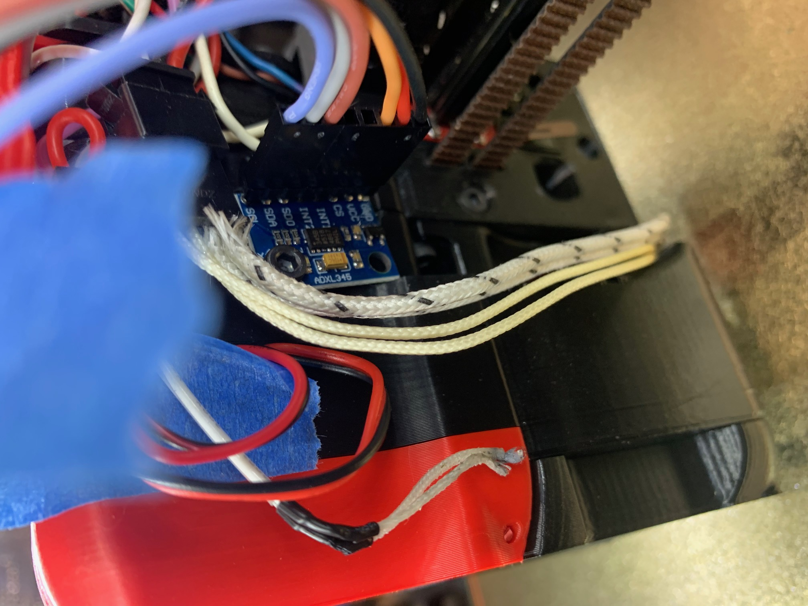
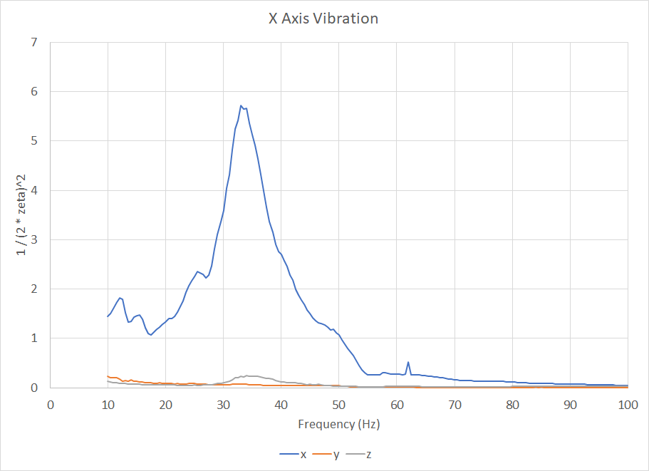
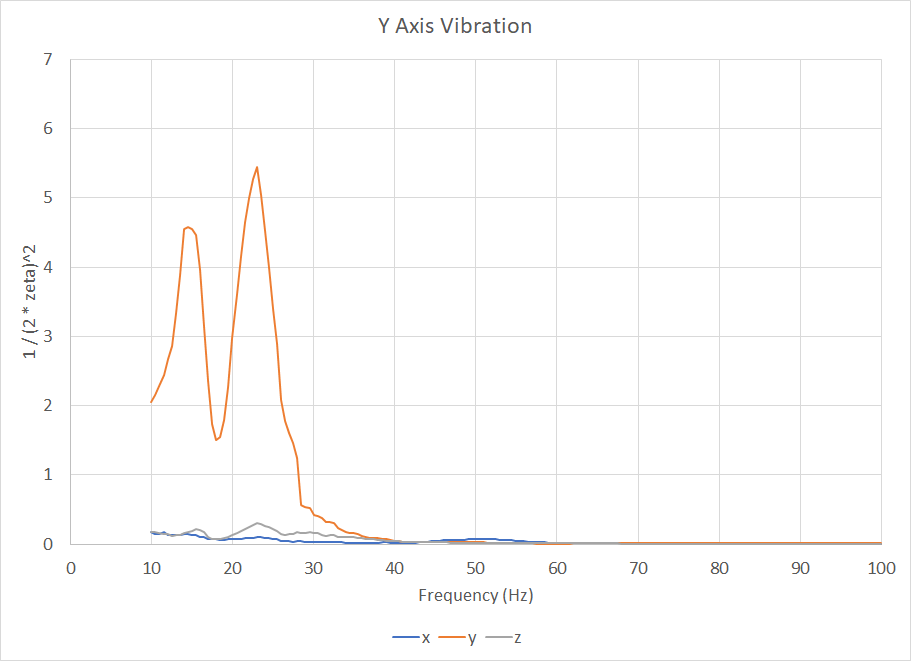
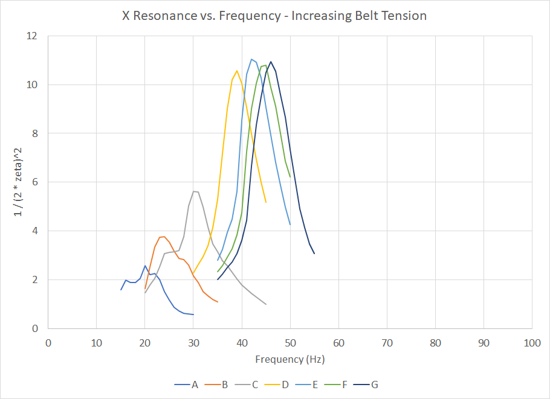
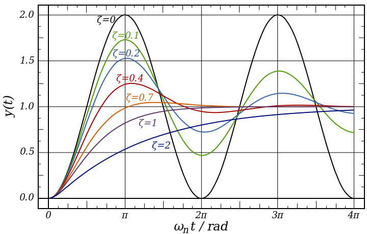
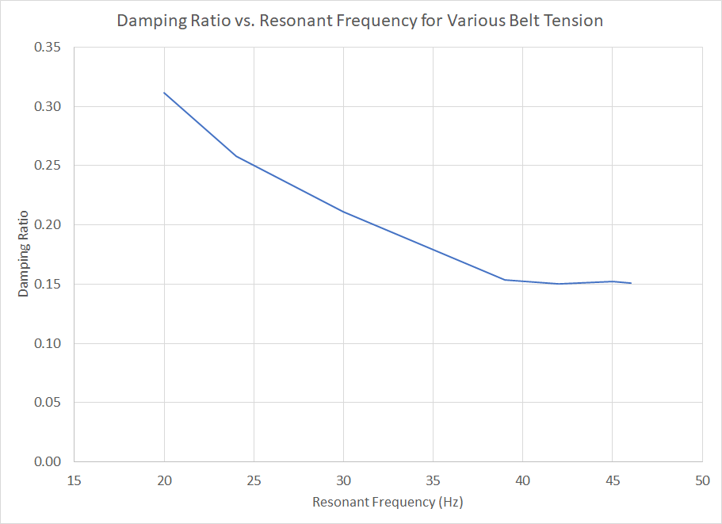
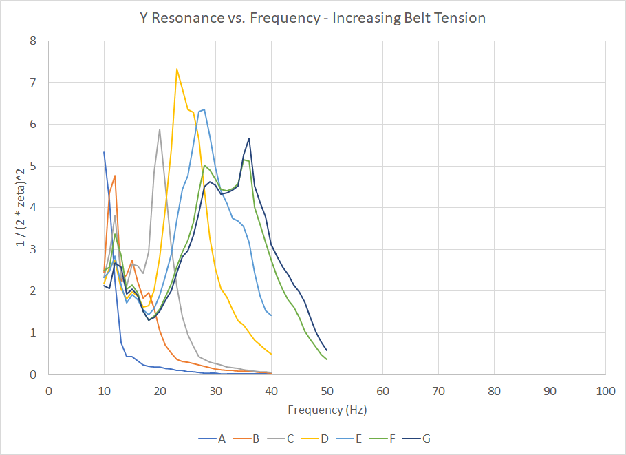

Klipper [input_shaper] results
====================

### Intro

Hello everyone!

This is a follow up video to the Klipper [input_shaper] overview, I have gathered some more data and would like to share it with you! I ran across Dmitri's accelerometer implementation, which allows you to directly measure resonances (in all axes) instead of using a test print by attaching a small module to your toolhead. This gives you a lot of rich information about your 3d printer and can help you fine tune it.

### Test Setup

First of all, 90% of the results I have here you can easily replicate yourself by purchasing an ADXL345 accelerometer and following Dmitri's guide [here](https://github.com/KevinOConnor/klipper/blob/5cb576c7ba4040df1acaea1985e24db8a8febbed/docs/Measuring_Resonances.md).

It was surprisingly cheap (~$6) and easy to set up (<1 hour including making the wire harness). It's important to get a secure mount to your toolhead so the accelerometer properly captures the resonance of the toolhead--in my case I was able to secure it to the side of my toolhead. Note that the output of the accelerometer is relative to its internal coordinate system--in this mounting scenario, the accelerometer's X and Z axes are swapped compared to the printer's axes. If you mount the accelerometer differently than this, your results may be unique.

### Theory

So what exactly are we trying to achieve here? That's a great question! At a basic level, by using an accelerometer on the toolhead we can find the frequencies that the printer resonates at during various move operations. These values will likely be very similar to the printed ringing tuning test, but an accelerometer allows us to get very accurate data quickly so we can iterate on tuning various parameters. It also allows us to understand if there are more complex resonances occurring between different axes or even two or more resonances.

To show this, let's look at our first test result, which checks for X axis resonant frequencies. The TEST_VIBRATIONS function starts at 10Hz and increments in 0.5Hz steps until it reaches 100Hz, and records the response of each axis of the accelerometer for each frequency. This allows us to see what frequency causes the system to resonate the most--which is also the frequency we should input into the [input_shaper] configuration so that it can suppress this frequency. 

In the graph below, we can see that the X axis on my CoreXY printer has a very clearly defined single resonant frequency which peaks at 33Hz. The other two axes (Y and Z) are largely undisturbed by the X axis movement. This is a fairly simple case!

Next, let's look at the Y axis:

In this case, we have two very clear peaks at 14.5Hz and 23Hz. This isn't ideal for two reasons--one, because the frequencies are so low, and because there are two. This may be able to be smoothed out using the 2hump_ei version of [input_shaper] centered between the two resonant frequencies. Ideally though, the printer would be changed to increase these frequencies--we'll touch on that in a bit. Note also here that the X and Z components are pretty isolated, which is good! This is definitely not always the case depending on what printer you have--sometimes there can be significant other components that could create extra complexity in your prints.

### Belt Tension Study

Let's look further into the cause of the low frequencies specifically on the Y axis in that last plot. Depending on your printer there may be a lot of different causes for resonant frequencies, but frequencies related to belts are a pretty common component across almost all printers. 

If you think of a guitar string, increasing the tension increases the pitch of the tone you hear. If the string is too tight, it may snap or deform, if it is too loose, it may not create a tone at all and may flop around unconstrained. Changing the mass of the string and anything attached to it also changes how it responds. 

Printer belts are very similar to this. If you over tighten a typical GT2 belt, you'll start to see vertical lines on your print at a 2mm spacing, equal to the pitch or spacing between teeth on the belt. If it's too lose, it may not vibrate much, but the toolhead may have "slop" and not go to precisely where the printer wants it to go. In between that there is still a wide range of tension that may be acceptable, but it's hard to really define the frequency--there are so many variables to control. With an accelerometer, though, you can measure the resonant frequencies and understand the impacts. 

For this study I wanted to capture a few points between the min and max values we just discussed, so I started with a low belt tension on both belts on my CoreXY printer and ran a series of tests similar to the previous ones, but at increasing belt tension. Each step stretched the belt by 0.5mm. 

This is a very clear chart--increasing tension (A is lowest tension, G is highest tension) increases the frequency of the resonant frequency and also increases the value on the Y axis. In this chart, the Y axis is 1/(2*zeta)^2, where zeta is the damping ratio. Damping ratio gives us insight into how long after a sharp change in direction the toolhead will continue oscillating. The chart below ([reference](https://en.wikipedia.org/wiki/File:2nd_Order_Damping_Ratios.svg)) shows a few different damping ratios and how it affects the oscillation pattern: 

A damping ratio of 0 means that the oscillation will continue indefinitely--if this was the case, the ringing pattern would exist on nearly all print surfaces. Damping ratios between 0 and 1 are "under damped"--the system will "overshoot" the target value/position and will oscillate for a period of time before the oscillations die out. A damping ratio of 1 is said to be "critically damped"--it approaches the target value quickly, without oscillating. Finally, a damping ratio greater than 1 is "over damped"--the system does not overshoot, but is sluggish and does not reach the target value quickly.

3d printers must respond quickly to changes in direction and have low resistance to movement--this means most of the typical damping that may exist in other systems isn't present except for (ideally) minor friction losses. In order to reduce resonance affects, we can reduce the impulse (acceleration) that drives the oscillation, but that's often not ideal as print speed is sacrificed. 

Moving back to the data, if we take the peaks from each of the belt tensions and solve for the damping ratio, we get this plot:

This means that as the belt tension is increased, the damping ratio decreases--oscillations will continue longer. If we revisit the guitar string example, this intuitively makes sense--if a guitar string is not tensioned enough, it will flop around and the resonances will quickly die. As tensions are increased, vibrations last longer. While a reduced damping ratio seems intuitively worse, a well defined (higher) resonant frequency may respond better to input shaping?

Let's revisit Y resonance. In a CoreXY printer, the mass is significantly higher when moving in the Y direction because the toolhead (X mass) plus the entire X axis structure (in the case of my printer, 2020 aluminum extrusion, MGN rails, etc) must move. 

The resonant/natural frequency can be calculated by the following formula:

Natural Frequency = sqrt(k/m) = sqrt(spring constant/mass)

In the case of a CoreXY printer, the "k" term will be the same for both X and Y motion. If we estimate the Y moving mass to be twice the X moving mass, we would expect the natural frequency to be approximately 

​	y_natural_frequency/x_natural_frequency =sqrt(1/2) = 0.707

Comparing the resonant frequency peaks of the "E" belt tension in both the X chart above and Y chart below, we get close to that value:

28Hz / 43Hz = 0.651

