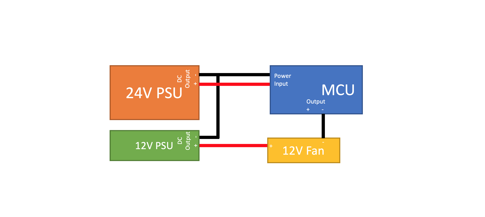
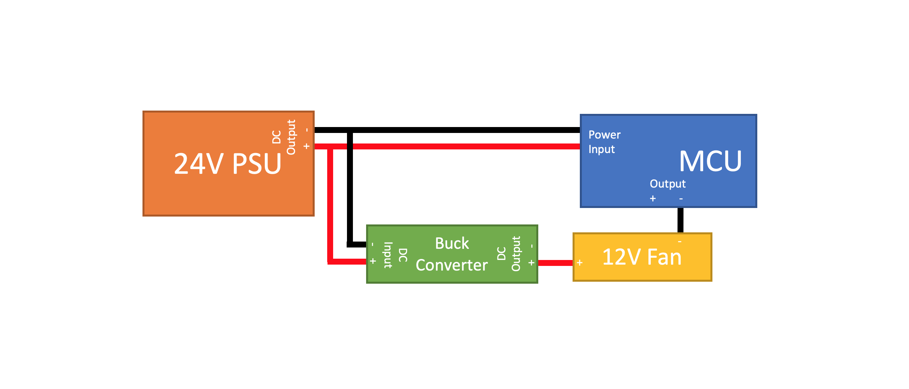
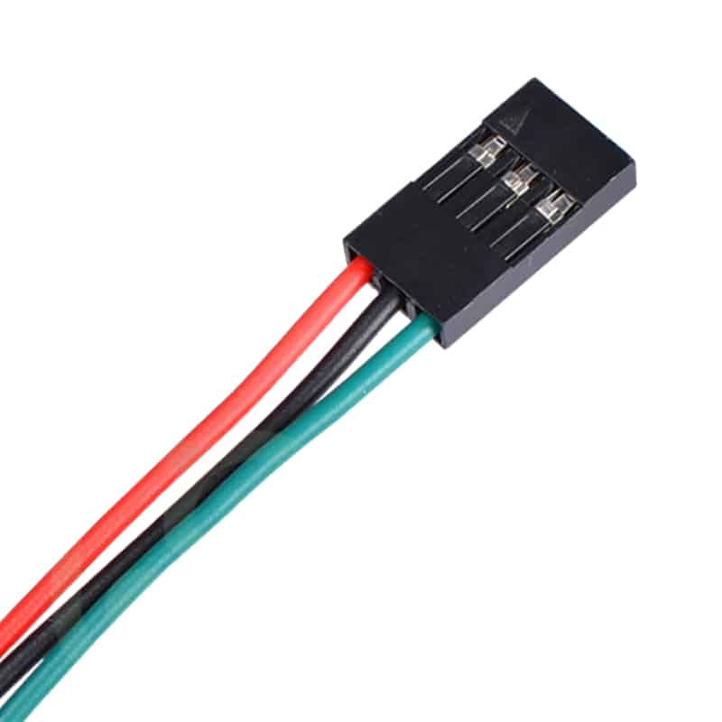
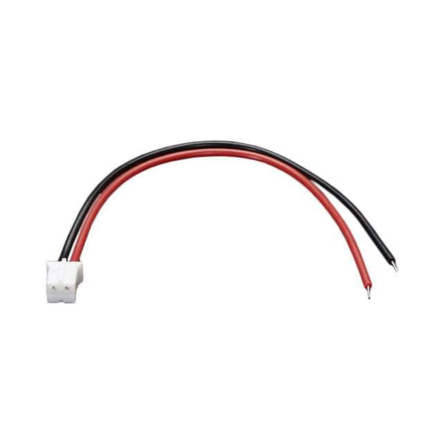
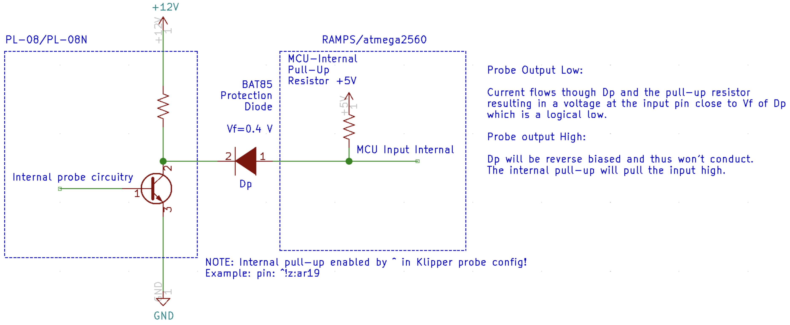

# General Wiring Guide

This guide gives a high level overview of a few of the most common questions people have when wiring their printer. These notes should apply to all Voron printer builds, regardless of controller board used.

## Safety Note

When wiring up your printer electronics, **<u>you will be working with high voltage wiring.</u>** Always double check to make sure that the printer is unplugged and wait for a minute to make sure that any capacitors in your power supplies have discharged before touching any wire or terminal that may be live. 

## Damage Risk

<u>**Never plug or unplug any device (high or low voltage) while the the printer is powered.**</u> In addition to being a safety hazard, you will may damage electronic components. Of particular note are stepper drivers which can easily be damaged by connecting or disconnecting stepper motors or drivers while powered.

## DC Power Supply Wiring

The latest generation of Voron printers spec the use of two or more independent DC power supplies

- 24V DC Power Supply for Controller board(s)
- 5V DC Power Supply for Raspberry Pi 
- 12V (Optional) for any other devices (Fans, LEDs, etc)

**Important!** Connect the DC 0V output (labeled -V) of all of your DC power supplies together so they have the same reference. If you do not do this, you may have issues (devices may not turn on when they are supposed to, or they may be damaged due to exceeding voltage limits).

### Using 5V/12V Accessories with 5V/12V PSU and 24V MCU (Optional)

It is possible to use your MCU to control fans, LEDs, and other devices even when those devices do not use 24V. Most MCUs (RAMPS, SKR 1.3/1.4, etc) use the (-) pin to control if a device is switched on or off.

This means that if you wire the +V side of your fan to an external power supply (5V for a 5V fan, 12V to a 12V fan, etc) and connect the -V side of your fan to a (-) pin on the SKR 1.3, you can switch the fan on and off. As mentioned above, this *only* will work if you tie the DC 0V of both power supplies together. Note, in the diagram below, only DC wires are shown. Red represents +V, and Black represents 0V.

### Using 5V/12V Accessories with Buck Converter and 24V MCU (Optional)

If you have low power accessories (fans, small LEDs, etc) that operate off of 5V or 12V, you can use a buck converter to drop 24V to the device voltage. Make sure that the buck converter you purchase can supply the current that your accessory requires.

**<u>*Do not power your device with the buck converter until verifying the output voltage.*</u>** Adjustable buck converters typically arrive from the supplier with the buck converter adjusted to the maximum voltage setting. This will damage your 5V/12V accessory. To prevent damage to your accessory, connect the buck converter to the 24V power supply first with nothing connected to the output. Once the buck converter is powered, measure the buck converter DC output with a multimeter. If the value is not your target value and the buck converter is adjustable, carefully turn the potentiometer on the buck converter with a screwdriver until the output voltage is your desired value. Finally, connect the output of your buck converter to your accessory as shown below:

## Stepper Driver Installation

- **Warning!** Always be sure to orient drivers correctly when installing. If you plug the drivers in backwards, they may permanently be damaged. Enable (EN) and Direction (DIR) pins *typically* are on the side opposite the stepper motor plugs, but check your controller board for specifics. If you have TMC 2209 drivers, you may notice there are additional pins on one end of the board--these may have corresponding plugs in the controller board which may help you align the drivers.
- Place included heatsink on top of stepper driver copper pad and provide adequate cooling during operation or you may experience layer shifts or other undesirable behaviors. This is even more important with TMC 2208s as they have higher RDSon and generate more heat for the same stepper motor current.
- **Note:** if you do not have BigTreeTech TMC2209s and are using a BigTreeTech control board, the pinout may be different. See link [here](https://www.anet3d-forum.de/viewtopic.php?f=82&t=4776) for more information on setting up these drivers.

## Wire Terminals

Depending on your control board, you may need to use Dupont, JST-XH, and/or MX connectors to connect your devices. Be sure to read the documentation for your specific control board(s) to know which type to purchase.

Dupont:

JST-XH Connector:

## Stepper Motor Wiring

For wiring the stepper motors, keep the same wire color sequence that your stepper motors came with and make sure you use the same sequence for all of your stepper motors. If you have the spec motors from StepperOnline, the wires should in the the color order shown in the SKR 1.3 wiring diagrams on the following pages, however, other manufacturers may have different wire orders. The colors of the wire do not matter--only the order. 

**Important:** If you find out your motors are going the wrong direction once you start up your printer for the first time, you do not need to repin your connectors. You can invert the DIR (direction) pins in your configuration by adding or removing ! in front of pin and it will work properly.

## Endstop Wiring

There are two ways of wiring your endstops: NC (normally closed) or NO (normally open). For normally closed configurations, the endstop switch allows current to flow through it when it is not triggered. For normally open configurations, the end stop switch only allows current to flow through it when it is triggered. 

While both of these configurations will work fine in an ideal world, NC configurations are more robust because if a wire breaks or a terminal becomes disconnected, the printer will think that the end stop has triggered and the printer will stop movement before the toolhead crashes in to the frame or the bed. 

Wiring mechanical switches for NC operation is easy, as they generally have three pins exposed. With a multimeter, probe each combination of the three pins until you find a pair that has continuity (0 ohm resistance) when the switch is not triggered, but does not have continuity (infinite resistance) when the switch is triggered. The outer two pins are often the NC pins, but verify prior to installation.

## Inductive Probe Wiring

The PL-08N inductive probe that is used for Z Tilt Adjust (V1) or Quad Gantry Leveling (V2) needs to be powered with 12-24V, not the standard 5V that is used for typical end stop switches. This is critical because if it is powered with 5V its sense distance will be so low that the nozzle will crash in to the build surface.  

The issue with this is that the output signal from the sensor is approximately the same voltage as the sensor is powered with. This means if you power the sensor with 24V, it will send 24V to a pin on the micro that is supposed to never have more than 5V applied to it. This is where the BAT85 diode comes in to play. It is oriented so that when the probe signal wire is HIGH (12-24V), no current will flow to the SKR input pin, so the SKR pin will read HIGH voltage due to the internal pull-up resistor. If the probe signal is LOW (0V), current will flow from the SKR board through the diode, through the Probe to GND, which will pull the SKR pin LOW. Below is a circuit diagram explaining this: 

For the inductive probe, you will need to make sure that you purchase a NC probe, not a NO probe. You cannot change the configuration of the probe—it comes fixed from the factory in a specific configuration. If you happen to receive a NO probe it will still work but you may risk crashing the nozzle in to the bed if a wire breaks. 