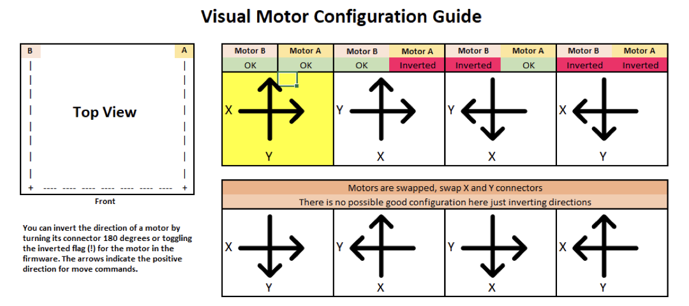

# Initial Startup - Configuration Checks

The moment you’ve been waiting for—your printer finally coming to life! Klipper has a very helpful configuration check guide that will help make sure that everything is operating properly. Please follow the steps detailed at the URL below:

https://github.com/KevinOConnor/klipper/blob/master/docs/Config_checks.md

## Endstop Check

Make sure that none of the X, Y, or Z Endstops are being pressed, and then send the following command via the Octoprint command line:

​	```QUERY_ENDSTOPS```

 The terminal window should respond with the following:

​	```Recv: x:open y:open z:open```

If any of them say “triggered” instead of “open”, double check to make sure none of them are pressed. Next, manually press the X endstop, send the QUERY_ENDSTOPS command again, and make sure that the X endstop says “triggered” and the Y and Z endstops stay open:

​	```Recv: x:TRIGGERED y:open z:open```

Repeat the test with the Y and Z endstops. 

You may find that one of your Endstops has inverted logic (it displays “open” when it is pressed, and “triggered” when it is not). In this case, go to your printer’s config file and add or remove the ! In front of the pin. For instance, if your X endstop was inverted, you would add a ! In front of your pin number as follows:

endstop_pin: P1.28 —> !P1.28

## Stepper Motor Check

To verify that each stepper motor is operating correctly, send the following command:

​	```STEPPER_BUZZ STEPPER=stepper_x```

Run this again for each of the motors (stepper_y, stepper_z, etc). Z motors should go UP first then down. If the stepper motors do not move, check wiring for loose connectors.

## XY Homing Check

It’s time to start by homing X and Y! You’ll want to be able to quickly stop your printer in case something goes wrong (ie, the tool head goes in the wrong direction). There are a few ways of doing this—one is to use the E-stop button on your display (if you have one installed). Test the button and see what happens—Klipper should shut down, but the Raspberry Pi and Octoprint will still be running, but disconnected from Klipper. Press “Connect” in the upper left corner of Klipper, and then in the Octoprint terminal window send a FIRMWARE_RESTART command to get your printer back up and running. 

The alternative to this is to have your laptop right next to the printer with “restart” already in the terminal command line in Octoprint. When you start homing your printer, if it goes in the wrong direction—quickly send the restart command and it will stop the printer. 

The final “nuclear” option is to power off the entire printer if something goes wrong. This is not ideal because doing this may corrupt the files on the SD card and you would have to reinstall everything from scratch. 

Now that you know how to stop the printer if something goes wrong, send the XY homing command to your printer:

​	```G28 X0 Y0```

This will only home X and Y, not Z. The tool head should:

1. Move to the right until it triggers the X endstop
2. Retract from the X endstop and move right again until it triggers the X endstop a second time
3. Move to the back of the printer until it triggers the Y endstop
4. Retract from the Y endstop and move backwards again until it triggers the Y endstop a second time

If the toolhead does not go in the correct direction, refer to the table below to figure out how to correct it. 



If you need to invert one of the motors, invert the direction pin (add or remove a ! before the pin). If the motors are going in the directions that match the lower row, swap your A and B motor connectors. For reference, motor B should be connected to the [stepper_x] driver, and motor A should be connected to the [stepper_y] driver.

## Define (0,0) Point

Once you have completed the previous step, home X and Y again:

​	```G28 X0 Y0``` 

Use Octoprint to move the nozzle to the front left corner of the bed. If the printer won't reach it, you can adjust the bed on the extrusions. Make sure whatever bed position you end up with you can still reach the Z switch if applicable. Once you can get the nozzle close to the front left corner of the bed, send an M114 command, which will return the following:

​	```X: 0.5mm, Y: 1mm```

If X and Y are not ~0-5mm, update “position_max” and “position_endstop” for both [stepper_x] and [stepper_y]:

​	For X: new = Current – Get Position X Result

​	For Y: New = Current – Get Position Y Result

If you update anything in your configuration file, save the file and then restart Klipper using FIRMWARE_RESTART.

## Z Endstop Pin Location Definition

Run another G28 X Y

Move the nozzle using Octoprint until it is directly above the Z Endstop switch. Send an M114 command and record the X and Y values. Update your homing routine (homing_override] or [safe_z_home] with these values, then restart Klipper. Run a full G28 and make sure that the printer properly homes X, Y, and Z. If your toolhead is not over the center of the bed at the end of G28, check the printer config file and uncomment the section in [homing_override] that lists your bed size.

## Probe Check

With the probe in the center of the bed, reconfirm that the probe is working correctly. When it is far from the bed, send the following command:

```QUERY_PROBE ```

This should return “open”. When a metal object is close to the probe, QUERY_PROBE should return “triggered”. Slowly reduce your Z height and run QUERY_PROBE each time until QUERY_PROBE returns “triggered”—make sure the nozzle is not touching the print surface (and has clearance). If the signal is inverted, add a “!” In front of the pin definition (ie, pin: !z:P1.24). 

## Probe Accuracy

With the bed and hotend cold (for now), move the probe to the center of the bed and run PROBE_ACCURACY. It will probe the bed 10 times in a row, and output a standard deviation value at the end. Make sure that the sensed distance is not trending (gradually decreasing or increasing over the 10 probes) and that the standard deviation is less than 0.003mm. 

Example of unstable PROBE_ACCURACY (trending downward during warm up). 

```
Send: PROBE_ACCURACY

Recv: // PROBE_ACCURACY at X:125.000 Y:125.000 Z:7.173 (samples=10 retract=2.000 speed=2.0

Send: M105

Recv: // probe at 125.000,125.000 is z=4.975000

Recv: // probe at 125.000,125.000 is z=4.960000

Recv: // probe at 125.000,125.000 is z=4.955000

Recv: // probe at 125.000,125.000 is z=4.952500

Recv: // probe at 125.000,125.000 is z=4.950000

Recv: // probe at 125.000,125.000 is z=4.947500

Recv: // probe at 125.000,125.000 is z=4.942500

Recv: // probe at 125.000,125.000 is z=4.937500

Recv: // probe at 125.000,125.000 is z=4.937500

Recv: // probe at 125.000,125.000 is z=4.932500

Recv: // probe accuracy results: maximum 4.975000, minimum 4.932500, range 0.042500, average 4.949000, median 4.948750, standard deviation 0.011948
```


## Quad Gantry Leveling (or Z Tilt)

Run Quad_Gantry_Level or Z_Tilt (V2.2 or V1.6). If the script errors out due to an “out of bounds” error, disable your stepper motors and slowly move your gantry or bed by hand until it is approximately flat. Re home your printer (G28) and then rerun the sequence. You may have to run it more than once—make sure that the adjustment value for each stepper motor converges to 0. If it diverges, check to make sure you have your stepper motors wired to the correct stepper driver (check documentation). 

## PID Tune Heated Bed

Move nozzle to the center of the bed and 20mm above the bed surface:

```G1 X150 Y150 Z20```

 Then run:

```PID_CALIBRATE HEATER=heater_bed TARGET=100```

This will perform a PID calibration routine that will last about 10 minutes. Once it is finished, type:

```SAVE_CONFIG```

This will save the parameters into your configuration file.

## PID Tune Hotend

Set the part cooling fans to 25%:

```M106 S64```

And then PID tune the hotend:

```PID_CALIBRATE HEATER=extruder TARGET=245```

It will perform a PID calibration routine that will last about 5 minutes. Once it is finished, type:

```SAVE_CONFIG```

This will save the parameters into your configuration file.

## Run Quad_Gantry_Level or Z_TILT with Hot Chamber

Home your printer:

```G28```

Then run

**Important**: This will be the first time that you have run a Quad Gantry Leveling at a high chamber temperature. To make sure that your probe has stabilized with the heated bed at 100C and the extruder at 240C, run PROBE_ACCURACY with the nozzle in the center of the bed. If the values are trending (increasing or decreasing) throughout the 10 probes, or the standard deviation is greater than 0.003mm, wait another 5 minutes and try again. Once the readings are stable, run QUAD_GANTRY_LEVEL. Make a note of how long it took for your probe readings to stabilize and remember this for the next time you start your print—you’ll typically want to wait 10-20 minutes from a cold printer to your first print to make sure temperatures stabilize.

## Z Offset Adjustment

If you did not run PID tuning, set your extruder to 245C and heated bed to 100C and let the printer heat up for 15 minutes.

Run a G28, and then a Quad_Gantry_Level, and then another G28.

Move the nozzle to the center of the bed

​	```Z_ENDSTOP_CALIBRATE```

Slowly move the nozzle toward the bed by using

​	```TESTZ Z=-1```

Until the nozzle is relatively close to the bed, and then stepping down with 

​	```TESTZ Z=-0.1```

Until the nozzle touches a piece of paper on top of the build plate. If you go far down, you can move the nozzle back up with:

​	```TESTZ Z=0.1```

Once you are satisfied with the nozzle height, type

​	```ACCEPT``` 

​	```SAVE_CONFIG```

If you get an error (out of bounds), send Z_ENDSTOP_CALIBRATE, ACCEPT, and then SAVE_CONFIG. This will redefine the 0 bed height so you will be able to get closer. However, if you get this error it likely means that the shaft for your Z Endstop is too long, and may catch on the print head during a print. It is best to cut the shaft so that it is flush with the top surface of your PEI.

## Extruder Calibration

Before your first print, you need to make sure that your extruder extrudes the correct amount of material. With the hotend at temperature, make a mark between your roll of filament and your extruder, 120mm away from the entrance to your extruder. In Octoprint, extrude 50mm 2 times (for a total of 100mm—Klipper doesn’t allow you to extrude more than 50mm at a time), then measure from the entrance of your extruder to the mark you made previously. In a perfect world, it would measure 20mm (120mm - 20mm = 100mm), but it usually won’t be. Take the value you have in your configuration file and update it using the following:

New Config Value = Old Config Value * (Actual Extruded Amount/Target Extruded Amount)

Note that a higher configuration value means that less filament is being extruded.

Paste the new value into your configuration file, restart Klipper, and try again. Once your extrusion amount is within 0.5% of the target value (ie, 99.5-100.5mm for a target 100mm of extruded filament), your extruder is calibrated!

## Fine Tuning Z Height

As a reference, if you adjust the Z offset during a print using the Tune menu on your display, you can update your printer configuration with this new value. Remember that higher values for your Z_endstop_position mean that the nozzle will be closer to the bed. 

New Position = Old Position - Tune Adjustment

New Position = Old Position - (-0.050) = Old Position + 0.050