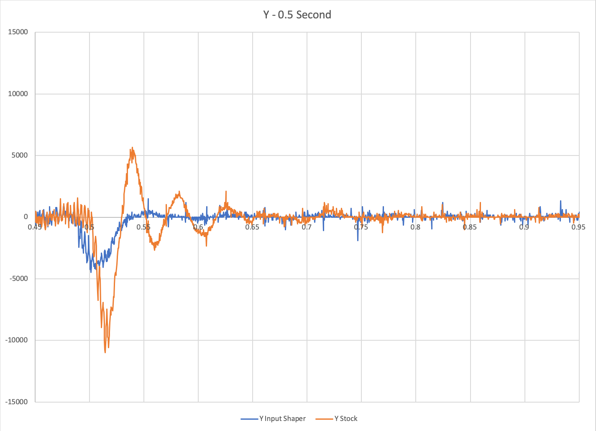

# Instructions for running Resonance Macros

Note these instructions and macros are not complete, and may not work on your printer. Use at your own risk :) 

1. Follow setup guide here for ADXL345 sensor (including switching to branch), but do not run full resonance testing yet : https://github.com/KevinOConnor/klipper/blob/work-adxl345-20200730/docs/Measuring_Resonances.md 

2. Copy vibration_macro.cfg to your Pi in the same folder as your printer.cfg

3. Add [include vibration_macro.cfg] to your printer.cfg file

4. Send a ```RESTART``` command to Klipper

5. Run ```resonance_test```. Note it will take approximately 80 minutes to complete.

6. Look at data in your /tmp/ folder--find peaks from vib-x.csv and vib-y.csv data files

7. Add [input_shaper] section to your config:

   ```
   [input_shaper]
   shaper_freq_x: (put your peak frequency from vib-x.csv here)
   shaper_freq_y: (put your peak frequency from vib-y.csv here)
   ```

8. Send another ```RESTART``` command to Klipper
9. Run ```vibration_test```, which will take approximately 60 seconds or less to complete. 
10. Check your /tmp/ folder for 8 new data files named by time stamps. Each file will correspond to:
    1. X Vibration (with input shaper)
    2. Y Vibration (with input shaper)
    3. B Vibration (with input shaper)
    4. A Vibration (with input shaper)
    5. X Vibration (without input shaper)
    6. Y Vibration (without input shaper)
    7. B Vibration (without input shaper)
    8. A Vibration (without input shaper)
11. Compare the corresponding data files with/without input shaper and plot the different responses.
12. Note after you have run vibration_test, [input_shaper] will be disabled. Please ```RESTART``` Klipper before running another test!

I hope this is useful for you!


Initial Results (X):


Initial Results (Y):

